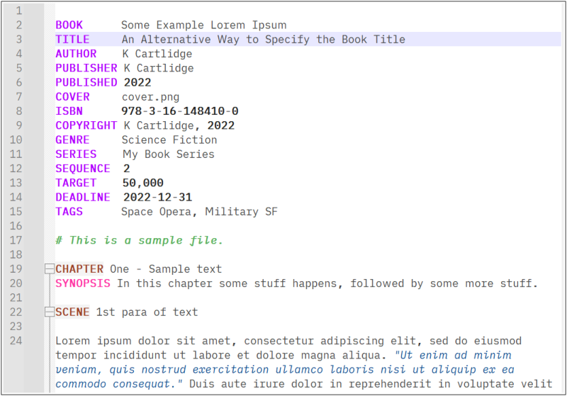

# npp-prose-language

This is a simple language file for [Notepad++](https://notepad-plus-plus.org/), which will provide some formatting useful for writers (not coders).
It will kick in for files with the following extentions:

- `.prose`
- `.book`
- `.chapter`
- `.scene`

## Installing

In the Notepad++ navigate through the menu to `Language`, `User Defined Language`, `Open User Defined Language folder ...` and Windows Explorer will open up a folder.
Place the [npp-userDefinedLang-prose-kcartlidge.xml](./npp-userDefinedLang-prose-kcartlidge.xml) file from here into that folder and restart Notepad++, at which point the language highlighter will be available for all the matching file types.

## The main stuff it highlights

As this is designed for writers, not coders, the main highlighting is extremely simple so as to (a) not distract from the flow and (b) keep clutter minimal.

- *dialogue* is subtly coloured and italicised
- *numbers* are emboldened

## Other highlighted stuff you *may* want to use

For my own tooling, there are several other things you can do. Or ignore them entirely.

- *comments* can be done in four different ways
  - `//` comments out the remainder of the line
  - `--` comments out the remainder of the line
  - `#` comments out the remainder of the line
  - `/*` and `*/` will comment out just the enclosed text
- *scenes* with the ability to fold them up for easy navigation
  - `SCENE` designates a new scene, and `END` marks the end of that scene
    - For clarity only use those markers at the start of a line (not enforced)
    - Remember to end one scene before starting the next

## Final stuff that you almost certainly can ignore

These are also for my own tooling, but feel free if it helps.

- `BOOK`, `CHAPTER`, `TITLE`, `AUTHOR`, `ISBN`, `PUBLISHER`, `PUBLISHED`, `SERIES`, `SEQUENCE`, `COVER`
  - These are all highlighted, but have no function beyond that. For my own purposes I expect lines of book metadata where each is one of these tags followed by a value.

## Example content

Below this is a *screenshot* of the outcome.

```
BOOK Some example Lorem Ipsum
AUTHOR K Cartlidge
PUBLISHER K Cartlidge

# This is a sample file only.

CHAPTER One - Sample text

SCENE 1st para of text

Lorem ipsum dolor sit amet, consectetur adipiscing elit, sed do eiusmod
tempor incididunt ut labore et dolore magna aliqua. "Ut enim ad minim
veniam, quis nostrud exercitation ullamco laboris nisi ut aliquip ex ea
commodo consequat." Duis aute irure dolor in reprehenderit in voluptate
velit esse cillum dolore eu fugiat nulla pariatur. Excepteur sint occaecat
cupidatat non proident, sunt in culpa qui officia deserunt mollit anim
id est laborum.

END

SCENE 2nd para

Sed ut perspiciatis unde omnis iste natus error sit voluptatem accusantium
doloremque laudantium, totam rem aperiam, eaque ipsa quae ab illo inventore
veritatis et quasi architecto beatae vitae dicta sunt explicabo. Nemo enim
ipsam voluptatem quia voluptas sit aspernatur aut odit aut fugit, sed quia
consequuntur magni dolores eos qui ratione voluptatem sequi nesciunt.
"Neque porro quisquam est, qui dolorem ipsum quia dolor sit amet, consectetur,
adipisci velit, sed quia non numquam eius modi tempora incidunt ut labore
et dolore magnam aliquam quaerat voluptatem. Ut enim ad minima veniam, quis
nostrum exercitationem ullam corporis suscipit laboriosam, nisi ut aliquid
ex ea commodi consequatur?" Quis autem vel eum iure reprehenderit qui in ea
voluptate velit esse quam nihil molestiae consequatur, vel illum qui dolorem
eum fugiat quo voluptas nulla pariatur?

END
```


